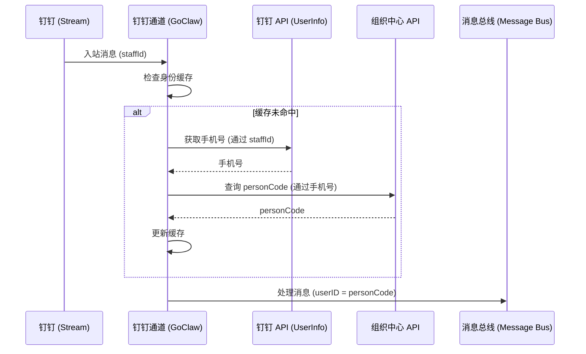

# 钉钉用户 ID 适配：组织中心集成设计文档

本文档描述了将钉钉通道的用户标识系统适配为使用外部**组织中心 (Organization Center)** 返回的 `person_code` 的设计方案和实现计划。

## 1. 问题背景

默认情况下，钉钉通道使用 `senderStaffId` 作为唯一用户标识 (`userID`)。然而，为了保持跨通道的一致性并与内部业务逻辑对齐，我们需要使用用户在业务系统中的 `person_code` 进行身份识别。

获取 `person_code` 需要用户的手机号，而钉钉的入站消息负载中并不直接提供手机号。

## 2. 架构概览

系统在钉钉入站消息处理逻辑中实现了一个“身份转换层”。



## 3. 核心特性

### 3.1 Mock 模式 (测试隔离)
为了在内部组织中心无法访问（如内网环境）时也能进行开发和测试，系统支持 **Mock 模式**。

- **配置**: `mode: "mock"`
- **行为**: 立即返回预配置的 `mock_code`，跳过所有外部 API 调用。
- **目的**: 允许在不依赖基础设施的情况下，测试端到端的消息流和 Agent 业务逻辑。

### 3.2 身份缓存
为了减少延迟并避免触发 API 频率限制，转换结果将存储在内存缓存中。
- **Key**: `staffId`
- **Value**: `personCode`
- **TTL**: 可配置（默认 100 小时，建议设置为长期有效）。

### 3.4 本地映射备份 (调试友好)
为了方便调试和排查问题，系统会将转换成功的身份信息同步保存到本地文件中。
- **文件路径**: `{DataDir}/dingtalk_identity_mappings.json`
- **内容**: 包含 `staffId`、`mobile`、`personCode` 以及转换时间。
- **作用**: 即使没有数据库权限，管理员也可以通过 `cat` 该文件快速核对身份映射关系。

### 3.3 降级策略
如果真实查询失败（API 错误或未找到用户）：
1. 记录错误日志用于审计。
2. （可选配置）回退到原始的 `staffId`，以确保服务的可用性。

## 4. 接口规范

### 4.1 钉钉用户信息接口
- **Endpoint**: `GET https://api.dingtalk.com/v1.0/contact/users/{userId}`
- **认证**: 钉钉 Access Token
- **所需字段**: `mobile`

### 4.2 组织中心接口
- **Endpoint**: `GET https://orgcenter.capitaleco-pro.com/api/OrgPersonRestApi/listUsers?phone={mobile}`
- **Header 参数**:
  - `Access-Key`: 外部集成 Key
  - `Secret-Key`: 外部集成 Secret
- **响应处理**: 从 `data` 数组的第一个元素中提取 `personCode`。

## 5. 配置定义

将在 `DingtalkConfig` 中增加以下字段：

```go
type OrgCenterConfig struct {
    Enabled   bool   `json:"enabled"`
    Mode      string `json:"mode"`       // "real" 或 "mock"
    Endpoint  string `json:"endpoint"`   // 基础 URL
    AccessKey string `json:"access_key"` // Header: Access-Key
    SecretKey string `json:"secret_key"` // Header: Secret-Key
    MockCode  string `json:"mock_code"`  // Mock 模式下的 person_code
}
```

## 6. 实施清单

- [ ] 在 `internal/config/config_channels.go` 中添加 `OrgCenterConfig`。
- [ ] 在 `internal/channels/dingtalk/client.go` 中添加 `GetUserInfo`（获取手机号）。
- [ ] 在 `internal/channels/dingtalk/org_center.go` 中实现 `OrgCenterClient`。
- [ ] 实现本地映射文件持久化逻辑 (`dingtalk_identity_mappings.json`)。
- [ ] 在 `internal/channels/dingtalk/messaging.go` 中实现带缓存和文件备份的 `LookupPersonCode` 逻辑。
- [ ] 添加针对 Mock 和 Real 模式的单元测试。
